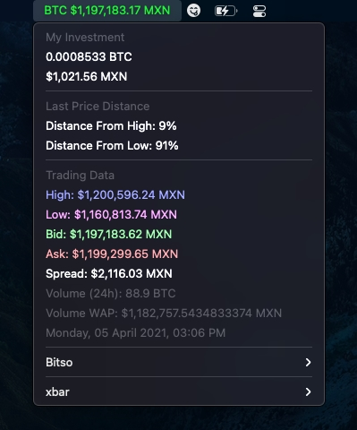
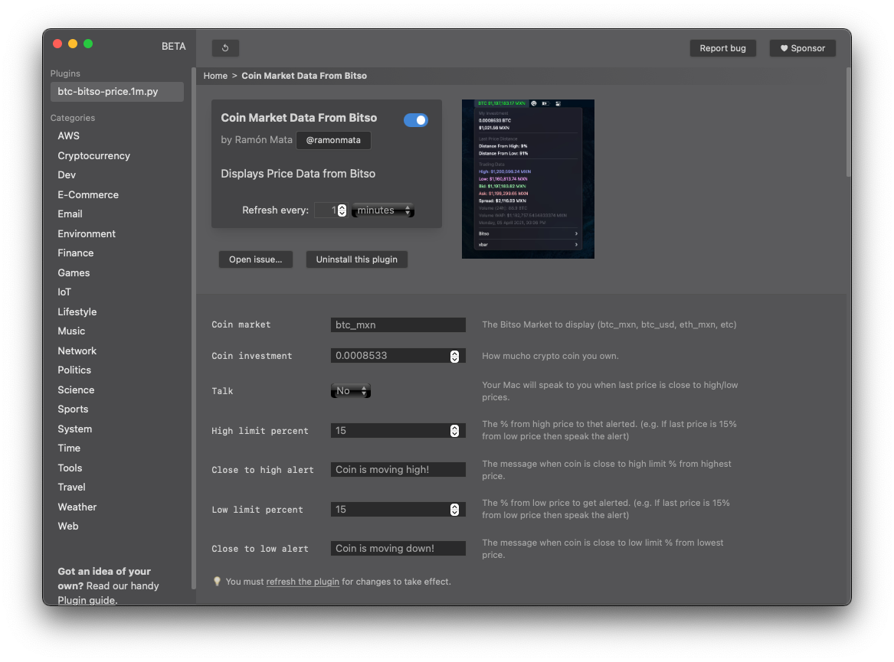

## Bitso Market Data for [xbar app](https://xbarapp.com)

### Features: 
- Displays Bitso Market Data
- Change between Bitso Markets
- Set your Crypto investment
- Current Price changes from Green to Red accordingly with their position between high and low prices
- Computer speaks to you when price is going *up/down* or if new *high/low* price is reached

## Settings you can change:
Go to "Plugin browser..." in the xbar app and make the changes you need

Enjoy!